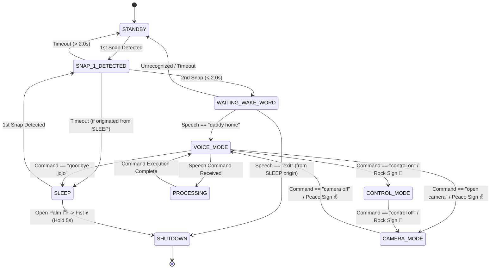

# AUHIP (Jarvis_demo) — Comprehensive System Documentation

> **System Name:** AUHIP Executive Personal Assistant (`Jarvis_demo`)  
> **Version:** 1.0.0  
> **Architecture:** Decoupled Event-Driven Async System with Local-First Hybrid LLM Brain & Computer Vision  

---

## 📋 Table of Contents

1. [Project Overview & Architectural Context](#1-project-overview--architectural-context)
2. [Full Operating Instructions & Setup](#2-full-operating-instructions--setup)
3. [User Interface & Visual Layout](#3-user-interface--visual-layout)
4. [Module-by-Module Functionality & Logic](#4-module-by-module-functionality--logic)
5. [Finite State Machine (FSM) & State Logic](#5-finite-state-machine-fsm--state-logic)
6. [Event Bus Wiring & Communication Matrix](#6-event-bus-wiring--communication-matrix)
7. [Customization & Skill Extension Guide](#7-customization--skill-extension-guide)

---

## 1. Project Overview & Architectural Context

**AUHIP** is an intelligent, privacy-focused executive personal assistant built in Python. It integrates zero-click acoustic wake-up (double-snap detection), offline speech-to-text (STT), computer-vision gesture recognition, and a hybrid local-first Large Language Model (LLM) orchestration engine.

### 🌟 Key Architectural Pillars

* **Local-First Processing:** Core voice recognition and primary LLM intent routing run entirely locally using [Vosk](https://alphacephei.com/vosk/) and [Ollama](https://ollama.com) (`qwen2.5:3b`), ensuring rapid response times and offline capability.
* **Smart Cloud Escalation:** Complex tasks (coding, deep analysis, architecture planning, or low local confidence) are automatically escalated to Google Cloud Gemini.
* **Acoustic Wake-Up:** Energy-spike analysis listens for double-snaps to wake the device without pressing keyboard shortcuts or clicking buttons.
* **Computer Vision Modes:** Real-time webcam tracking powered by MediaPipe provides hand gesture recognition (Camera Mode) and desktop cursor tracking (Control Mode).
* **Decoupled Event Bus:** GUI, audio, vision, and state machine modules communicate strictly through an asynchronous publish/subscribe event broker (`AsyncEventBus`).
* **Non-Blocking Asynchronous UI:** Built using `PyQt6` and `qasync`, wrapping Python’s `asyncio` event loop so hardware streams and AI calls never freeze the user interface.

---

## 2. Full Operating Instructions & Setup

### 🛠️ Hardware & Software Requirements

* **OS:** Windows 10/11, macOS, or Linux.
* **Python:** Python 3.10 or 3.11 recommended.
* **Microphone & Webcam:** Any standard audio input device and USB/Built-in webcam.
* **Ollama:** Installed locally for offline LLM execution.

---

### 🚀 Step-by-Step Installation

#### 1. Clone & Install Python Dependencies
```bash
# Navigate to project root
cd Jarvis_demo

# Install required Python packages
pip install -r requirements.txt
```

#### 2. Download Offline Vosk Speech Model
1. Visit [AlphaCephei Vosk Models](https://alphacephei.com/vosk/models).
2. Download `vosk-model-small-en-us-0.15` (approx. 40MB).
3. Unpack the directory directly into the project root:
   ```text
   Jarvis_demo/vosk-model-small-en-us-0.15/
   ```

#### 3. Setup Local LLM (Ollama)
1. Install [Ollama](https://ollama.com).
2. Download the recommended fast tool-calling model:
   ```bash
   ollama pull qwen2.5:3b
   ```
3. Start the Ollama background service:
   ```bash
   ollama serve
   ```

#### 4. Configure Environment Variables (`.env`)
Copy `.env.example` to `.env` in the project root:
```ini
# Local LLM Configuration
OLLAMA_BASE_URL="http://localhost:11434"
LOCAL_MODEL_NAME="qwen2.5:3b"
LOCAL_TIMEOUT_SECONDS=45.0
ESCALATION_CONFIDENCE_THRESHOLD=0.70

# Optional Cloud Fallback (Gemini)
GOOGLE_API_KEY="your-google-gemini-api-key"

# User System Preferences
WEATHER_CITY=""
TIMER_CHIME="true"
```

---

### 🎬 How to Launch

The assistant can be launched in three ways using provided batch scripts or command line arguments:

#### Option A: Direct Interactive Mode (Recommended)
Launches the full PyQt6 GUI window and automatically arms Voice Mode upon startup.
```bash
# Using Batch File
run_direct.bat

# Or via Command Line
python main.py --mode direct
```

#### Option B: Standby Background Listener Mode
Launches AUHIP minimized/hidden, passively listening for double-snaps or wake phrases before showing the GUI.
```bash
# Using Batch File
run_standby.bat

# Or via Command Line
python main.py --mode standby
```

#### Option C: Ollama + Assistant Launcher
Automates launching Ollama service before starting AUHIP.
```bash
run_with_ollama.bat
```

---

### 🎮 User Activation & Workflow Guide

```text
[ STANDBY MODE ] ──(Snap 2x)──> [ SNAP DETECTED ] ──(Snap 2x)──> [ WAITING WAKE WORD ]
                                                                       │
                                                                 "daddy home"
                                                                       │
                                                                       ▼
[ SLEEP MODE ] <──"goodbye jojo"──── [ VOICE MODE ] <──────────────────┘
      │                                 │       │
      │                                 │       ├──────> "open camera" ───> [ CAMERA MODE ]
      └──(Snap 2x + "daddy home")───────┘       │                               │
                                                └──────> "control on" ────> [ CONTROL MODE ]
```

1. **Wake-up via Acoustic Snaps:**
   * Snap your fingers twice within 2 seconds.
   * AUHIP transitions to `WAITING_WAKE_WORD` mode and displays visual snap indicators.
2. **Wake Phrase:**
   * Say **"daddy home"** (or custom wake phrase).
   * AUHIP will activate **Voice Mode** with an audio chime and full interactive state.
3. **Voice Commands:**
   * Speak any instruction (e.g., *"What's the weather in Tokyo?"*, *"Open browser"*, *"Set a timer for 5 minutes"*, *"Read code file main.py"*).
4. **Entering Vision Modes:**
   * Say **"open camera"** → Enter **Camera Mode** (MediaPipe hand gesture control).
   * Say **"control on"** → Enter **Control Mode** (Virtual cursor tracking).
5. **Returning to Sleep / Standby:**
   * Say **"goodbye jojo"** → Transitions back to **Sleep Mode**.
   * Perform Emergency Gesture (Open Palm 🖐️ to Fist ✊ hold for 5 seconds) → Immediately powers off AUHIP.

---

## 3. User Interface & Visual Layout

The AUHIP interface is built using a dark, modern industrial theme (`auhip/gui/theme.py`) featuring dynamic CSS cards, smooth transitions, and animated widgets.

```text
┌────────────────────────────────────────────────────────────────────────────────────────┐
│                                NAVIGATION BAR (nav_bar.py)                             │
├───────────────────────────────┬───────────────────────────────┬────────────────────────┤
│ LEFT PANEL (left_panel.py)    │ CENTER PANEL (center_panel.py)│ RIGHT PANEL            │
│                               │                               │ (right_panel.py)       │
│ ┌───────────────────────────┐ │ ┌───────────────────────────┐ │ ┌────────────────────┐ │
│ │ State Indicator Card      │ │ │ Waveform Visualizer       │ │ │ Active Commands    │ │
│ │ (state_panel.py)          │ │ │ (waveform_widget.py)      │ │ │ Directory          │ │
│ └───────────────────────────┘ │ └───────────────────────────┘ │ │ (active_commands)  │ │
│ ┌───────────────────────────┐ │ ┌───────────────────────────┐ │ └────────────────────┘ │
│ │ System Hardware Monitor   │ │ │ Vision Feed / Overlay     │ │ ┌────────────────────┐ │
│ │ (CPU & RAM Gauges)        │ │ │ (vision_panel.py)         │ │ │ Command History    │ │
│ └───────────────────────────┘ │ └───────────────────────────┘ │ │ (history_panel.py) │ │
│ ┌───────────────────────────┐ │ ┌───────────────────────────┐ │ └────────────────────┘ │
│ │ Audio Input Selector      │ │ │ Speech Transcript Feed    │ │ ┌────────────────────┐ │
│ │ (Mic Hardware Dropdown)   │ │ │ (transcript_panel.py)     │ │ │ Last Command Card  │ │
│ └───────────────────────────┘ │ └───────────────────────────┘ │ │ (last_command)     │ │
│                               │ ┌───────────────────────────┐ │ └────────────────────┘ │
│                               │ │ Assistant Response Card   │ │                        │
│                               │ │ (response_panel.py)       │ │                        │
│                               │ └───────────────────────────┘ │                        │
├───────────────────────────────┴───────────────────────────────┴────────────────────────┤
│                           DEVELOPER / DEBUG PANEL (debug_panel.py)                      │
└────────────────────────────────────────────────────────────────────────────────────────┘
```

### 1. Navigation Bar (`auhip/gui/components/nav_bar.py`)
* **Logo & Title:** Displays assistant status.
* **Theme Switcher:** Toggles between Dark Mode (deep space grey) and Light Mode dynamically.
* **Vision Toggle:** Enable/disable camera processing.
* **Dev Tools Toggle:** Expands or collapses the bottom hardware/debug control panel.
* **Window Control:** Exit application button.

### 2. Left Panel (`auhip/gui/components/left_panel.py`)
* **State Indicator (`state_panel.py`):** Displays current FSM state (`STANDBY`, `VOICE_MODE`, `PROCESSING`, `CAMERA_MODE`) with custom glowing border animations.
* **Hardware Monitor:** Real-time CPU and Memory gauges updated via `psutil`.
* **Microphone Selector:** Live dropdown list of detected PyAudio devices for hot-swapping inputs.

### 3. Center Panel (`auhip/gui/components/center_panel.py`)
* **Audio Waveform Widget (`waveform_widget.py`):** Real-time sine wave and audio energy visualizer displaying mic levels during speech.
* **Vision Panel (`vision_panel.py`):** Displays camera feed, detected hand landmark bounding boxes, gesture names, and eye-gaze tracking indicators.
* **Transcript Panel (`transcript_panel.py`):** Shows real-time speech-to-text transcriptions from Vosk/Whisper.
* **Response Panel (`response_panel.py`):** Displays formatted response text generated by AUHIP.

### 4. Right Panel (`auhip/gui/components/right_panel.py`)
* **Active Commands Panel (`active_commands_panel.py`):** Mode-aware context directory showing available voice/gesture commands for the current state.
* **Command History Panel (`history_panel.py`):** Chronological log of executed commands and responses.
* **Last Command Card (`last_command_widget.py`):** Quick status overview of the most recently executed tool/action.

### 5. Developer/Debug Panel (`auhip/gui/components/debug_panel.py`)
* **Hardware Controllers:** Camera index selection, mic toggles, gesture sensitivity sliders.
* **State Overrides:** Buttons to force state transitions manually.
* **Skill Test Bench:** Execute any registered tool with custom JSON parameters.
* **Live Event Stream:** Real-time log monitor displaying all published event bus events.

---

## 4. Module-by-Module Functionality & Logic

### 📂 Directory Structure Overview

```text
Jarvis_demo/
├── main.py                     # Entry point & qasync event loop initialization
├── user/
│   └── identity.md             # System prompt, personality, user name configuration
├── auhip/
│   ├── audio/                  # PyAudio, snap detector, Vosk & Whisper STT
│   ├── core/                   # State machine, agent orchestrator, event bus, config
│   │   └── llm/                # Local/cloud router, Ollama, Gemini, escalation, tools
│   ├── gui/                    # PyQt6 windows, components, and theme definitions
│   ├── skills/                 # Voice commands & tool implementations
│   └── vision/                 # MediaPipe camera worker, gesture & eye tracking
```

---

### 1. Core Orchestration (`auhip/core/`)

#### [`main.py`](file:///d:/Desktop/Code/personal/project/Jarvis_demo/main.py)
* **Logic:** Sets up the `qasync` event loop combining `PyQt6` and `asyncio`. Instantiates hardware drivers (`Microphone`, `SnapDetector`, `SpeechRecognizer`, `VisionWorker`), builds the main GUI, and starts background async audio processing. Parses command-line flags `--direct` and `--standby`.

#### [`auhip/core/agent.py`](file:///d:/Desktop/Code/personal/project/Jarvis_demo/auhip/core/agent.py)
* **Class:** `AuhipAgent`
* **Logic:** The primary intelligence orchestrator. Registers all available tools from `auhip/skills/`, manages local static intent shortcuts (`_local_route()`), and queries the `HybridLLMRouter` for unstructured queries.
* **Functions:**
  * `_register_all_tools()`: Registers system, info, productivity, media, organizer, workspace, and YouTube tools into the `ToolManager`.
  * `_local_route(text)`: Checks input against predefined regex/keyword mappings to execute skills directly without hitting an LLM (0ms delay).
  * `process_command(text)`: Routes text through `HybridLLMRouter` to return structured execution results.

#### [`auhip/core/state_machine.py`](file:///d:/Desktop/Code/personal/project/Jarvis_demo/auhip/core/state_machine.py)
* **Class:** `AuhipStateMachine`
* **Logic:** Manages execution states using an explicit `State` enum (`STANDBY`, `SNAP_DETECTED`, `WAITING_WAKE_WORD`, `VOICE_MODE`, `PROCESSING`, `CAMERA_MODE`, `CONTROL_MODE`, `SLEEP`, `SHUTDOWN`). Controls audio listening loops and hardware states. Handles timeouts and publishes state change events.

#### [`auhip/core/event_bus.py`](file:///d:/Desktop/Code/personal/project/Jarvis_demo/auhip/core/event_bus.py)
* **Class:** `AsyncEventBus`
* **Logic:** Decoupled pub/sub event engine. Allows components to call `event_bus.publish("EVENT_NAME", payload)` and register async handlers via `@event_bus.subscribe("EVENT_NAME")`.

#### [`auhip/core/config.py`](file:///d:/Desktop/Code/personal/project/Jarvis_demo/auhip/core/config.py)
* **Class:** `Config`
* **Logic:** Dataclass loading parameters from `.env` and defaults (timeouts, snap thresholds, wake phrases, API keys).

---

### 2. LLM Subsystem (`auhip/core/llm/`)

* **`router.py` (`HybridLLMRouter`):** Evaluates user prompts against `EscalationEngine`. Decides whether to invoke the local Ollama provider or escalate directly to Gemini Cloud.
* **`local_model.py` (`OllamaLocalProvider`):** Handles HTTP communication with Ollama API (`/api/generate` and `/api/chat`). Enforces JSON tool-calling response structures.
* **`cloud_model.py` (`GeminiCloudProvider`):** Communicates with Google Gemini API for complex tasks or coding queries.
* **`escalation.py` (`EscalationEngine`):** Scans prompt text for complex keywords (`write code`, `refactor`, `architecture`) or evaluates confidence metrics to force cloud escalation.
* **`prompt_builder.py` (`PromptBuilder`):** Merges system instructions from `user/identity.md`, tool schemas, and conversation history into a structured prompt.
* **`response_parser.py` (`ResponseParser`):** Extracts tool calls, JSON payloads, and clean natural language responses from raw model outputs.
* **`context_manager.py` (`ContextManager`):** Maintains short-term conversation memory (sliding window of max $N$ messages) and handles token budget pruning.
* **`tool_manager.py` (`ToolManager`):** Registry mapping tool schema names to Python callable functions in `auhip/skills/`.

---

### 3. Audio Processing Subsystem (`auhip/audio/`)

* **`snap_detector.py` (`SnapDetector`):** Converts raw PCM audio chunks into RMS energy levels. Identifies sharp energy spikes exceeding `SNAP_THRESHOLD_MULTIPLIER`. Implements a refractory period (`SNAP_REFRACTORY_PERIOD = 0.3s`) to prevent false double-triggers from a single acoustic wave.
* **`speech_recognition.py` (`SpeechRecognizer`):** Wraps offline Vosk model engine. Feeds audio bytes into `KaldiRecognizer` to yield transcribed text without cloud latency. Supports Google Speech Recognition fallback when online.
* **`whisper_recognizer.py` (`WhisperRecognizer`):** Optional local Whisper model recognizer for higher-accuracy offline STT.
* **`microphone.py` (`Microphone`):** Interface managing PyAudio streams, non-blocking chunk reading, and audio device switching.

---

### 4. Computer Vision Subsystem (`auhip/vision/`)

* **`worker.py` (`VisionWorker`):** A `QThread` running an independent vision pipeline loop. Grabs camera frames and feeds them to MediaPipe solvers.
* **`camera.py` (`Camera`):** Threaded OpenCV webcam wrapper handling non-blocking frame acquisition.
* **`gesture_engine.py` (`GestureEngine`):** Calculates hand landmark positions and angles to recognize static & dynamic gestures:
  * 🖐️ **Open Palm:** Idle / Reset
  * ✊ **Fist:** Hold gesture / Exit sequence
  * ✌️ **Peace Sign:** Toggle Camera Mode
  * 🤘 **Rock Sign:** Toggle Control Mode
  * ☝️ **Pointing:** Cursor movement / Click trigger
  * 🤌 **Pinch:** Drag / Selection
  * 👋 **Shake Up / Down:** Volume adjustment
* **`motion_engine.py` (`MotionEngine`):** Tracks frame-to-frame movement vectors.
* **`eye_tracker.py` & `blink_detector.py`:** Calculates Eye Aspect Ratio (EAR) using MediaPipe Face Mesh to detect blinks and eye direction.
* **`gaze_estimator.py` & `attention_engine.py`:** Estimates screen focus coordinates and measures user attention score.

---

### 5. Skills & Executable Tools (`auhip/skills/`)

* **`system_controls.py`:** System sleep, default browser opener, system volume mute/up/down, screenshot capture, media playback controls (play/pause/next/prev).
* **`information.py`:** Time/date query, live weather retrieval via Open-Meteo, web search via DuckDuckGo, system help guide.
* **`organizer.py`:** Task list management (`add_task`, `list_tasks`, `complete_task`), calendar event scheduler, stock price lookup, GitHub repository search, and safe workspace code file management (`read_code_file`, `write_code_file`, `list_workspace_files`, `delete_file`).
* **`productivity.py`:** Countdown timer with GUI audio alerts, desktop application launcher (`open_app`).
* **`youtube_music.py`:** YouTube Music browser launcher and automated search.
* **`home_automation.py`:** Smart home mode trigger logic.

---

## 5. Finite State Machine (FSM) & State Logic

AUHIP uses a strictly enforced finite state machine (`auhip/core/state_machine.py`) to handle state transitions safely.

### 🔄 FSM State Diagram



### 📊 State Transition Rules

| Initial State | Event / Trigger | Target State | Action / Behavior |
|---|---|---|---|
| `STANDBY` / `SLEEP` | Single Snap Detected | `SNAP_1_DETECTED` | Starts 2.0s window timer |
| `SNAP_1_DETECTED` | Second Snap (< 2.0s) | `WAITING_WAKE_WORD` | Plays snap sound, enables wake word listener |
| `SNAP_1_DETECTED` | Timeout (> 2.0s) | Origin State | Reverts back to `STANDBY` or `SLEEP` |
| `WAITING_WAKE_WORD` | "daddy home" detected | `VOICE_MODE` | Plays wake chime, opens active voice UI |
| `VOICE_MODE` | Any valid command | `PROCESSING` | Executes local route or LLM tool, returns result |
| `VOICE_MODE` | "open camera" / ✌️ | `CAMERA_MODE` | Activates camera feed and gesture recognition |
| `VOICE_MODE` | "control on" / 🤘 | `CONTROL_MODE` | Activates hand cursor control mode |
| `CAMERA_MODE` | "camera off" / ✌️ | `VOICE_MODE` | Deactivates camera worker, restores voice UI |
| `CONTROL_MODE` | "control off" / 🤘 | `CAMERA_MODE` | Exits cursor control back to camera sub-mode |
| `VOICE_MODE` | "goodbye jojo" | `SLEEP` | Deactivates listening, enters low-power sleep |
| `SLEEP` | Emergency Gesture | `SHUTDOWN` | Holds Open Palm to Fist for 5s → Application terminates |

---

## 6. Event Bus Wiring & Communication Matrix

All major components communicate asynchronously over `auhip/core/event_bus.py`.

| Event Name | Publisher Module | Subscriber Module(s) | Payload Content | Purpose |
|---|---|---|---|---|
| `SNAP_DETECTED` | `SnapDetector` | `StateMachine`, `MainWindow` | `{ "count": int }` | Triggered when acoustic snap spike is recognized. |
| `STATE_CHANGED` | `StateMachine` | `MainWindow`, `StatePanel` | `{ "old_state": State, "new_state": State }` | Updates UI state displays & glowing borders. |
| `MODE_CHANGED` | `StateMachine` | `MainWindow`, `DebugPanel`, `ActiveCommandsPanel` | `{ "mode": str }` | Updates available command context list. |
| `SPEECH_RECOGNIZED` | `SpeechRecognizer` | `StateMachine`, `TranscriptPanel` | `{ "text": str }` | Publishes raw live STT transcriptions. |
| `AUHIP_RESPONSE` | `Agent`, `StateMachine` | `MainWindow`, `ResponsePanel` | `{ "text": str }` | Delivers assistant text responses to UI. |
| `COMMAND_EXECUTED` | `StateMachine` | `MainWindow`, `LastCommandWidget` | `{ "command": str, "result": str }` | Log of successfully completed skills. |
| `GESTURE_DETECTED` | `VisionWorker` | `StateMachine`, `VisionPanel` | `{ "gesture": str, "confidence": float }` | Emits recognized hand gestures. |
| `MOTION_DETECTED` | `VisionWorker` | `StateMachine` | `{ "motion": str }` | Optical flow movement events. |
| `SET_VISION_MODE` | `StateMachine` | `VisionWorker` | `{ "mode": str }` | Configures MediaPipe worker state. |
| `TOGGLE_FULLSCREEN` | `Agent` | `MainWindow` | `{}` | Window geometry modification event. |
| `MINIMIZE_WINDOW` | `Agent` | `MainWindow` | `{}` | Minimizes main application window. |
| `APP_EXIT` | `StateMachine` | `MainWindow` | `{}` | Triggers application shutdown sequence. |

---

## 7. Customization & Skill Extension Guide

### 🧠 1. Customizing Personality & System Prompt
Edit `user/identity.md`. This markdown document serves as the **system prompt** injected into every LLM request.

```markdown
### User Name
Master Alex

### Personality Archetype
Jarvis-like, refined, calm, highly analytical, loyal

### Communication Rules
- Concise responses (maximum 2 sentences for simple queries)
- Technical precision
```

---

### 🔧 2. Adding a New Voice Skill (4-Step Workflow)

#### Step 1: Write the Skill Function
Create or edit a file in `auhip/skills/` (e.g., `auhip/skills/system_controls.py`):
```python
async def toggle_dark_mode() -> str:
    """Toggles the system UI dark theme."""
    from auhip.core.event_bus import event_bus
    await event_bus.publish("TOGGLE_THEME", {})
    return "Dark mode toggled."
```

#### Step 2: Export in `auhip/skills/__init__.py`
```python
from .system_controls import toggle_dark_mode
```

#### Step 3: Register Tool Schema in `auhip/core/agent.py`
Inside `AuhipAgent._register_system_tools()`:
```python
self.tool_manager.register_tool(
    ToolSchema(
        "toggle_dark_mode",
        "Toggles the user interface dark/light theme."
    ),
    toggle_dark_mode
)
```

#### Step 4: Add Instant Local Route (Optional)
To execute instantly without hitting an LLM, add to `_build_local_routes()` inside `auhip/core/agent.py`:
```python
(["toggle dark mode", "switch theme", "dark mode"], toggle_dark_mode),
```

---

### ⚙️ 3. Tuning Sensitivity & Knobs

All configuration defaults are managed in `auhip/core/config.py` and can be overridden in `.env`:

| Setting | Location | Default | Explanation |
|---|---|---|---|
| `SNAP_THRESHOLD_MULTIPLIER` | `config.py` / `.env` | `6.0` | Increase if keyboard clacks trigger false snaps; decrease if snaps are missed. |
| `SNAP_REFRACTORY_PERIOD` | `config.py` | `0.3s` | Minimum delay between sound peaks to avoid double counting one snap. |
| `COMMAND_TIMEOUT` | `config.py` | `10.0s` | Seconds to wait for voice input before returning to `IDLE`. |
| `LOCAL_TIMEOUT_SECONDS` | `.env` | `45.0s` | Timeout before falling back from Ollama to Gemini Cloud. |
| `ESCALATION_CONFIDENCE_THRESHOLD` | `.env` | `0.70` | Threshold score below which query escalates to Gemini Cloud. |

---

## 🛠️ Summary of Key Project Files

| File Path | Description |
|---|---|
| [`main.py`](file:///d:/Desktop/Code/personal/project/Jarvis_demo/main.py) | Application entry point & async loop launcher |
| [`auhip/core/agent.py`](file:///d:/Desktop/Code/personal/project/Jarvis_demo/auhip/core/agent.py) | Central hybrid routing agent & tool manager |
| [`auhip/core/state_machine.py`](file:///d:/Desktop/Code/personal/project/Jarvis_demo/auhip/core/state_machine.py) | Finite state machine orchestrator |
| [`auhip/core/event_bus.py`](file:///d:/Desktop/Code/personal/project/Jarvis_demo/auhip/core/event_bus.py) | Async event bus broker |
| [`auhip/core/llm/router.py`](file:///d:/Desktop/Code/personal/project/Jarvis_demo/auhip/core/llm/router.py) | Hybrid local (Ollama) / cloud (Gemini) router |
| [`auhip/audio/snap_detector.py`](file:///d:/Desktop/Code/personal/project/Jarvis_demo/auhip/audio/snap_detector.py) | Energy spike acoustic snap detector |
| [`auhip/audio/speech_recognition.py`](file:///d:/Desktop/Code/personal/project/Jarvis_demo/auhip/audio/speech_recognition.py) | Offline Vosk STT engine |
| [`auhip/vision/worker.py`](file:///d:/Desktop/Code/personal/project/Jarvis_demo/auhip/vision/worker.py) | MediaPipe camera worker thread |
| [`auhip/gui/main_window.py`](file:///d:/Desktop/Code/personal/project/Jarvis_demo/auhip/gui/main_window.py) | Main PyQt6 application window |
| [`user/identity.md`](file:///d:/Desktop/Code/personal/project/Jarvis_demo/user/identity.md) | User personality & system prompt config |
